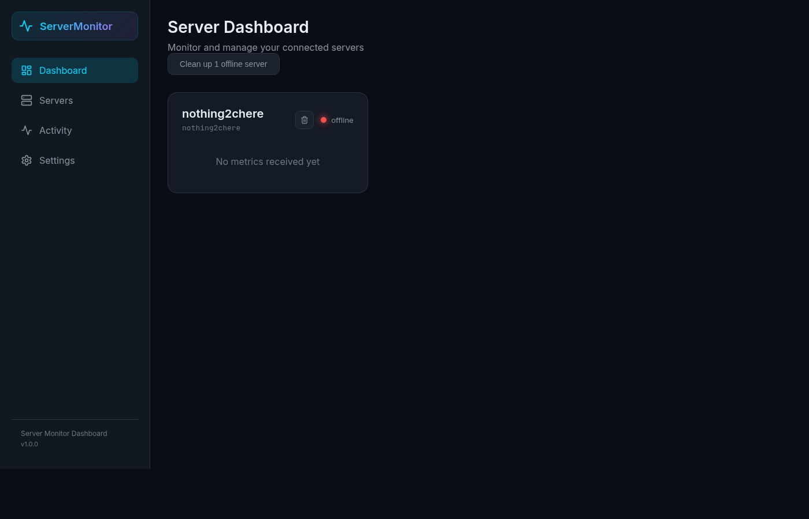
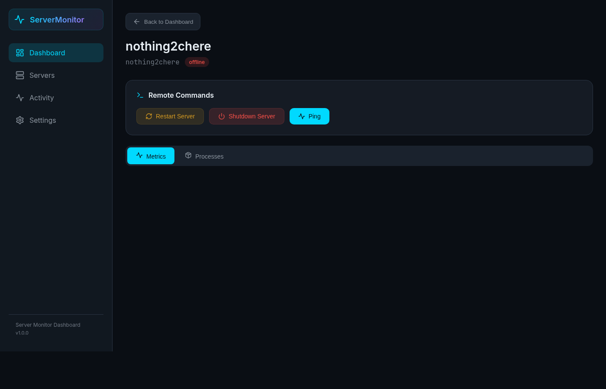
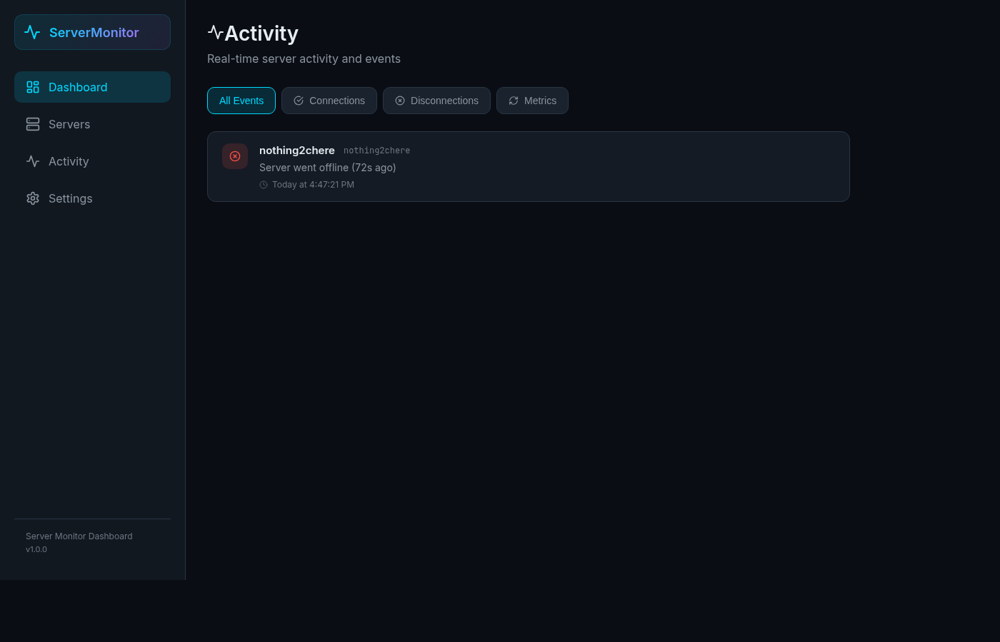
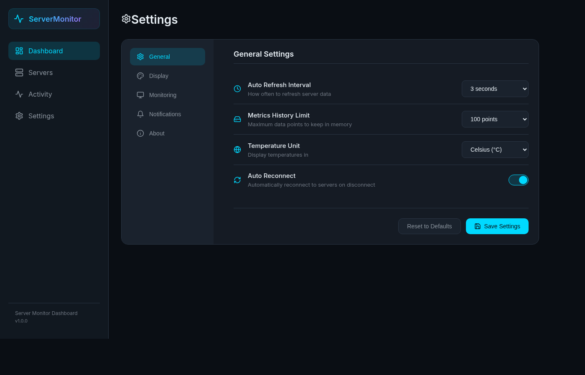

# 🖥️ Server Monitor Dashboard

A full-stack, real-time server monitoring solution built with **FastAPI**, **React**, and **Python**. Monitor CPU, memory, disk, network, GPU, and temperature metrics across multiple Linux servers from a single web dashboard.


---

## 📋 Table of Contents

- [Features](#-features)
- [Architecture](#-architecture)
- [Screenshots](#-screenshots)
- [Prerequisites](#-prerequisites)
- [Installation](#-installation)
- [Usage](#-usage)
- [Configuration](#-configuration)
- [API Reference](#-api-reference)
- [Project Structure](#-project-structure)
- [Monitored Metrics](#-monitored-metrics)
- [Security Notes](#-security-notes)
- [Troubleshooting](#-troubleshooting)
- [License](#-license)

---

## ✨ Features

### Real-Time Monitoring
- **CPU Usage** — Total and per-core utilization with frequency tracking
- **Memory** — Used, free, available, swap, buffers, and cache
- **Disk** — Per-partition usage across all mounted drives
- **Network** — Real-time bandwidth (bytes/packets sent & received)
- **GPU** — NVIDIA GPU utilization, memory, temperature, and power draw
- **Temperature** — CPU, GPU, and system sensor readings

### Server Management
- **Remote Restart/Shutdown** — Execute power commands from the dashboard
- **Process Manager** — View running processes and kill them by PID
- **Multi-Server Support** — Monitor unlimited servers from one dashboard
- **Offline Detection** — Automatically detects and marks offline servers
- **Bulk Cleanup** — Remove all offline servers with one click

### Dashboard UI
- **Dark & Light Themes** — Toggle between dark cyberpunk and clean light mode
- **Compact Mode** — Condensed view for monitoring many servers at once
- **Real-Time Charts** — Live-updating line and area charts via Recharts
- **Activity Feed** — Server connection/disconnection event log with filtering
- **Configurable Settings** — Refresh interval, temperature units (°C/°F), GPU/network visibility
- **System Notifications** — Browser notifications when servers go online/offline
- **Responsive Design** — Works on desktop, tablet, and mobile browsers

### Communication
- **WebSocket** — Primary real-time push from agents to dashboard
- **HTTP Polling** — Automatic fallback when WebSocket is unavailable
- **Auto-Reconnect** — Agents reconnect automatically on connection loss

---

## 🏗️ Architecture

```
┌─────────────────────┐      ┌─────────────────────────────────┐
│   Server Agent      │      │     Dashboard                   │
│   (Python script)   │      │                                 │
│                     │ WS   │  ┌──────────┐  ┌────────────┐  │
│  - Collects metrics ├─────►│  │ FastAPI   │  │ React SPA  │  │
│  - Executes cmds    │ HTTP │  │ Backend   ├──┤ Frontend   │  │
│  - Reports status   ├─────►│  │ (Python)  │  │ (TypeScript)│  │
│                     │◄─────┤  └──────────┘  └────────────┘  │
└─────────────────────┘ Cmds │                                 │
                             └──────────┬──────────────────────┘
                                        │
                                   Web Browser
                                   (Any OS)
```

**Components:**
1. **Server Agent** (`server_agent/`) — Lightweight Python script that runs on each monitored server
2. **Dashboard Backend** (`dashboard/backend/`) — FastAPI server with WebSocket support and REST API
3. **Dashboard Frontend** (`dashboard/frontend/`) — React 18 + TypeScript SPA with Recharts and Lucide icons

---

## 📸 Screenshots

### Dashboard Overview
Server grid with real-time status cards showing CPU, memory, disk, and network metrics at a glance.



### Server Detail
Drill into any server for detailed charts, process management, and remote commands.



### Activity Feed
Real-time event log tracking server connections, disconnections, and status changes.



### Settings
Fully configurable dashboard with dark/light themes, compact mode, temperature units, and notification preferences.



---

## 📦 Prerequisites

### Dashboard Host
- **Python 3.8+**
- **Node.js 18+** and **npm** (for building the frontend)
- Any OS (Windows, macOS, Linux)

### Monitored Servers
- **Debian Linux 64-bit** (or compatible)
- **Python 3.8+**
- Optional: **NVIDIA GPU drivers** (for GPU monitoring)
- Optional: **lm-sensors** (for temperature monitoring — install with `sudo apt install lm-sensors`)

---

## 🚀 Installation

### 1. Clone the Repository

```bash
git clone https://github.com/jsjames7715/server-monitor-dashboard.git
cd server-monitor-dashboard
```

### 2. Set Up the Dashboard Backend

```bash
cd dashboard/backend

# Create and activate a virtual environment
python3 -m venv venv
source venv/bin/activate    # Linux/macOS
# venv\Scripts\activate     # Windows

# Install dependencies
pip install -r requirements.txt
```

### 3. Build the Dashboard Frontend

```bash
cd dashboard/frontend

# Install Node.js dependencies
npm install

# Build the production frontend
npm run build
```

> The built files are output to `dashboard/frontend/dist/` and served automatically by the FastAPI backend.

### 4. Set Up the Server Agent (on each monitored server)

```bash
cd server_agent

# Create and activate a virtual environment
python3 -m venv venv
source venv/bin/activate

# Install dependencies
pip install -r requirements.txt
```

---

## 📖 Usage

### Start the Dashboard

```bash
cd dashboard/backend
source venv/bin/activate
python main.py
```

The dashboard will be available at **http://localhost:8000**.

### Start a Server Agent

On each server you want to monitor, run:

```bash
cd server_agent
source venv/bin/activate
python server_agent.py --url http://<dashboard-ip>:8000
```

The agent will automatically register with the dashboard and begin sending metrics.

### Server Agent Options

| Option | Description | Default |
|---|---|---|
| `--url`, `-u` | Dashboard URL | `http://localhost:8000` |
| `--id`, `-i` | Custom server ID | Auto-generated UUID |
| `--interval` | Metrics reporting interval (seconds) | `5` |

**Examples:**

```bash
# Basic usage with default settings
python server_agent.py --url http://192.168.1.100:8000

# Custom server ID and 10-second interval
python server_agent.py --url http://192.168.1.100:8000 --id web-server-01 --interval 10
```

### Dashboard Navigation

| Page | Description |
|---|---|
| **Dashboard** (`/`) | Server grid with status cards and quick metrics |
| **Servers** (`/servers`) | Same as Dashboard — lists all connected servers |
| **Server Detail** (`/server/:id`) | Full metrics view with charts, processes, and commands |
| **Activity** (`/activity`) | Event log of server connections and status changes |
| **Settings** (`/settings`) | Configure refresh interval, theme, temperature units, etc. |

### Remote Commands

From the **Server Detail** page, you can:
- **Restart** — Reboots the server (`shutdown -r now`)
- **Shutdown** — Powers off the server (`shutdown -h now`)
- **Kill Process** — Terminate any process by PID from the process table

---

## ⚙️ Configuration

### Dashboard Settings (via Settings page)

| Setting | Description | Default |
|---|---|---|
| Auto Refresh Interval | How often to poll for server updates | 3 seconds |
| Metrics History Limit | Max data points kept in memory | 100 |
| Temperature Unit | Celsius or Fahrenheit | Celsius |
| Auto Reconnect | Reconnect to servers on disconnect | Enabled |
| Dark Mode | Dark or light theme | Dark |
| Compact Mode | Condensed server cards | Disabled |
| Smooth Charts | Enable chart animations | Enabled |
| Show GPU Stats | Display GPU metrics panel | Enabled |
| Show Network Stats | Display network metrics panel | Enabled |
| System Notifications | Browser notifications for status changes | Enabled |

Settings are saved to `localStorage` and persist across sessions.

---

## 📡 API Reference

### REST Endpoints

| Method | Endpoint | Description |
|---|---|---|
| `GET` | `/api/servers` | List all registered servers |
| `GET` | `/api/servers/{id}` | Get server details and current metrics |
| `POST` | `/api/servers/register` | Register a new server agent |
| `DELETE` | `/api/servers/offline` | Remove all offline servers |
| `DELETE` | `/api/servers/{id}` | Remove a specific server |
| `GET` | `/api/servers/{id}/metrics` | Get metrics history (with `?limit=N`) |
| `POST` | `/api/metrics/{server_id}` | Receive metrics via HTTP polling |
| `POST` | `/api/servers/{id}/command` | Send a command to a server |
| `GET` | `/api/servers/{id}/processes` | Get running processes |
| `POST` | `/api/servers/{id}/kill/{pid}` | Kill a process by PID |

### WebSocket

| Endpoint | Description |
|---|---|
| `ws://host:8000/ws/{server_id}` | Real-time bidirectional communication |

**WebSocket Message Types:**

```json
// Agent → Dashboard (metrics)
{ "type": "metrics", "data": { "cpu": {...}, "memory": {...}, ... } }

// Dashboard → Agent (command)
{ "type": "restart", "id": "cmd_123" }
{ "type": "kill", "id": "cmd_456", "pid": 1234 }

// Agent → Dashboard (command result)
{ "type": "result", "command_id": "cmd_123", "result": { "success": true } }
```

### Interactive API Docs

FastAPI auto-generates interactive documentation at:
- **Swagger UI**: `http://localhost:8000/docs`
- **ReDoc**: `http://localhost:8000/redoc`

---

## 📁 Project Structure

```
server-monitor-dashboard/
├── dashboard/
│   ├── backend/
│   │   ├── main.py              # FastAPI application (API + WebSocket + static serving)
│   │   └── requirements.txt     # Python dependencies (FastAPI, Uvicorn, Pydantic)
│   └── frontend/
│       ├── src/
│       │   ├── App.tsx           # Main app with routing
│       │   ├── main.tsx          # Entry point
│       │   ├── hooks/
│       │   │   ├── useApi.ts     # HTTP API helper hook
│       │   │   └── useSettings.ts # Settings management hook
│       │   ├── pages/
│       │   │   ├── ServerList.tsx   # Dashboard / server grid
│       │   │   ├── ServerDetail.tsx # Individual server metrics
│       │   │   ├── Activity.tsx     # Activity event feed
│       │   │   └── Settings.tsx     # Settings panel
│       │   ├── styles/
│       │   │   └── index.css     # All styles (dark/light themes, components)
│       │   └── types/
│       │       └── index.ts      # TypeScript interfaces
│       ├── index.html
│       ├── package.json
│       ├── tsconfig.json
│       └── vite.config.ts
├── server_agent/
│   ├── server_agent.py          # Agent script (runs on monitored servers)
│   └── requirements.txt         # Python dependencies (psutil, requests, websocket-client)
├── SPEC.md                      # Detailed project specification
├── README.md                    # This file
└── .gitignore
```

---

## 📊 Monitored Metrics

| Category | Metrics Collected |
|---|---|
| **CPU** | Total usage %, per-core usage %, current/min/max frequency |
| **Memory** | Total, used, free, available, active, inactive, buffers, cached, swap |
| **Disk** | Per-partition: device, mountpoint, filesystem, total, used, free, percent |
| **Network** | Bytes/packets sent & received per second, totals, errors, drops |
| **GPU** | Utilization %, memory usage, temperature, power draw (NVIDIA only) |
| **Temperature** | CPU cores, GPU, system sensors via lm-sensors |
| **Processes** | PID, name, CPU%, memory%, status, username (top 100 by CPU) |
| **System** | Hostname, OS info, kernel version, architecture, boot time, uptime |

---

## 🔒 Security Notes

> ⚠️ This dashboard is designed for **trusted internal networks**. It does not include authentication.

- **No authentication** between server agents and the dashboard
- Use **firewall rules** to restrict dashboard access to trusted IPs
- Remote commands (restart/shutdown/kill) execute with the agent's user permissions
- Consider running behind a **reverse proxy** (nginx/Caddy) with HTTPS and basic auth for production use
- The dashboard stores data **in-memory only** — no database, no persistent storage

---

## 🔧 Troubleshooting

### Agent can't connect to the dashboard
- Verify the dashboard is running: `curl http://<dashboard-ip>:8000/api/servers`
- Check firewall rules allow port 8000
- Ensure the `--url` parameter uses the correct IP/hostname

### No GPU metrics showing
- NVIDIA drivers and `nvidia-smi` must be installed
- Verify with: `nvidia-smi --query-gpu=utilization.gpu --format=csv`
- Enable "Show GPU Stats" in dashboard Settings

### No temperature data
- Install lm-sensors: `sudo apt install lm-sensors && sudo sensors-detect`
- Verify with: `sensors`

### Frontend not loading
- Ensure you've built the frontend: `cd dashboard/frontend && npm run build`
- Check that `dashboard/frontend/dist/` exists and contains `index.html`

### Server shows as "offline"
- The dashboard marks servers offline after 60 seconds of no metrics
- Check if the agent process is still running on the server
- Check network connectivity between agent and dashboard

---

## 🛠️ Development

### Run Frontend in Dev Mode

```bash
cd dashboard/frontend
npm run dev
# Dev server runs at http://localhost:3000
```

### Run Backend

```bash
cd dashboard/backend
source venv/bin/activate
python main.py
# API runs at http://localhost:8000
```

### Tech Stack

| Component | Technology |
|---|---|
| Backend | Python, FastAPI, Uvicorn, Pydantic |
| Frontend | React 18, TypeScript, Vite, Recharts, Lucide React |
| Agent | Python, psutil, websocket-client, requests |
| Communication | WebSocket (primary), HTTP REST (fallback) |

---

## 📄 License

This project is licensed under the **MIT License**. See [LICENSE](LICENSE) for details.
